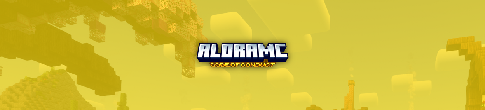

# 📔 AloraMC Code of Conduct

It's important to keep you safe around here, and your safety is one of AloraMC's top priorities. This page states the Code of Conduct, which any one interacting with AloraMC must abide by.

!!! danger "Consequences of Non-Compliance"
    There are no exceptions to following our basic conduct. Failure to abide with the Code of Conduct will result in punishment as deemed, if you feel you're punishment was unreasonable, get in touch with a support or a staff member.

1. **Toxicity and Harassment:** Bullying, harassment, or any form of aggressive behavior towards other community members will not be tolerated. Toxicity is looked down upon in our community and unjust, unreasonable toxicity will result in punishment dependant on multiple factors. If you feel uncomfortable or are being targeted, please report it to a staff member immediately. 

2. **Privacy and Safety**: Protect your privacy and the privacy of others. Refrain from sharing personal information and be cautious when interacting with others online. 

3. **Use of Derogatory Terms**
Examples of derogatory terms include but are not limited to: slurs*, inappropriate colloquialism, excessive and harsh curse words.

!!! warning "What is a slur?"
    A [slur](https://duckduckgo.com/&q=slur) is a term of which is a [derogatory](https://duckduckgo.com/&q=derogatory) or [insulting](https://duckduckgo.com/&q=insulting) term applied to particular group of people, whether minority or majority. [Discrimination](https://www.duckduckgo.com/&q=discrimination+meaning) is not tolerated within AloraMC and will be punished for strictly and severely.

4. **Explicit Discussions:** Keep conversations and content appropriate for all audiences, regardless of the platform. Any material deemed offensive, explicit, or inappropriate* will be removed, and those responsible may face disciplinary action.

5. **Excessive Use of Other Languages:**
Use of other languages in our chats is permitted, however if it is interrupting an ongoing conversation or there is players that struggle to understand you, we have other chat channels for other languages where you can converse.

6. **Respect Staff:** Staff are people too, and so have the right to be treated as such. If you have an issue with any of our staff members, do report it to another staff member you trust. Listen to and follow the instructions of our staff members across all platforms. They are here to help maintain a safe and enjoyable environment for everyone.

7. **No Unauthorised Advertising:** Avoid promoting external content without permission. Keep conversations relevant and constructive. Promoting things that are not related to AloraMC is not allowed and will be punished for.

8. **Encouragement of Self-Harm:** As previously stated, AloraMC is a safe environment for all therefore any comments encouraging self harm are forbidden. The only exception is if this discussion is related to the game, for example dying in game.

9. **Harmful / Malicious Links:**
It is forbidden to share any untrusted links in chat that are malicious or harmful to our players, this includes IP grabbers, pornography and file downloads that are unsafe. Most links are already forbidden in AloraMC, bypassing this block is punishable.

10. **Staff Impersonation:**
Attempts of impersonating any staff member is not allowed, this includes changing nicknames or Discord profile pictures to match those of which a staff member inherits or externally editing any messages NOT said by that staff member to make it seem like it was.

11. **Bribing for Real-Money Purchases:**
Bribary / begging other AloraMC players to spend their money on you to gift ranks or other premium items is also forbidden.

12. **Guilty by Association:**
Assisting other players to break rules can make you just as bad as the player breaking the rules and will be punished for. This is including staff members.

13. **Political / controversial discussions**
Debates on controversial, political, or religious topics are permitted as long as all participants maintain respect for one another and ensure a comfortable environment. In the event that a staff member deems it necessary, they have the authority to conclude the debate, and failure to comply with their decision may result in disciplinary measures. 

*Violating any aspect of this Code of Conduct may result in warnings, temporary mutes, temporary bans, or permanent bans, depending on the severity of the offense and the discretion of the staff.*